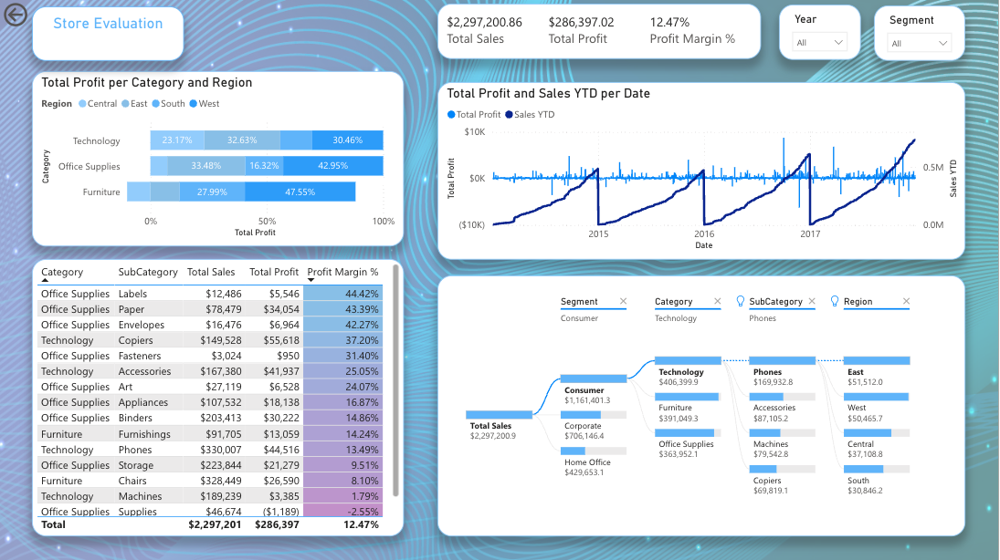
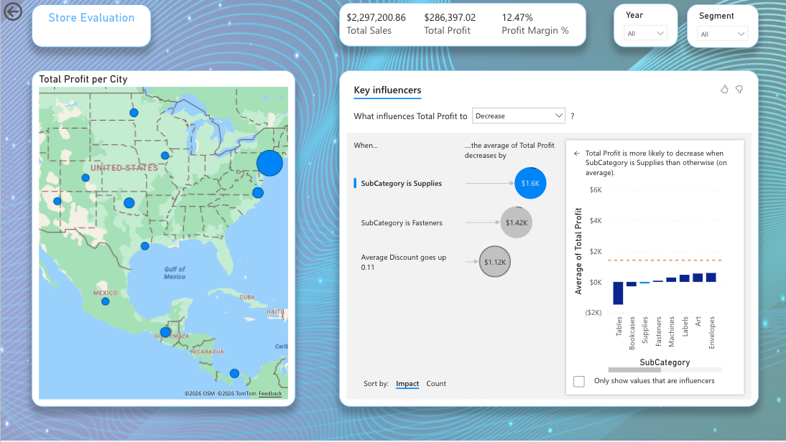

# Power BI Business Performance Analysis

## Project Goal

Design and implement an interactive business intelligence solution supporting sales and profitability analysis using Microsoft Power BI.

## Dataset

Superstore Sales Dataset (Kaggle)
## Dashboard Preview

## Business Questions

- Which products generate the highest profit?
- Which regions perform best?
- How do discounts impact profitability?
- What factors drive profit growth?

## Solution Architecture

- Power Query ETL
- Star Schema Data Model
- Fact and Dimension Tables
- DAX Measures
- AI-powered Insights

## Technologies

- Power BI
- DAX
- Power Query
- Data Modeling
- Business Analytics

## Key Results

- Technology category generated the highest profit
- West region achieved strongest profitability
- Higher discounts significantly reduced profit
- Several product groups generated negative margins

## Skills Demonstrated

- Business Analysis
- Data Analysis
- Dashboard Design
- KPI Monitoring
- Data Visualization
- Stakeholder Reporting